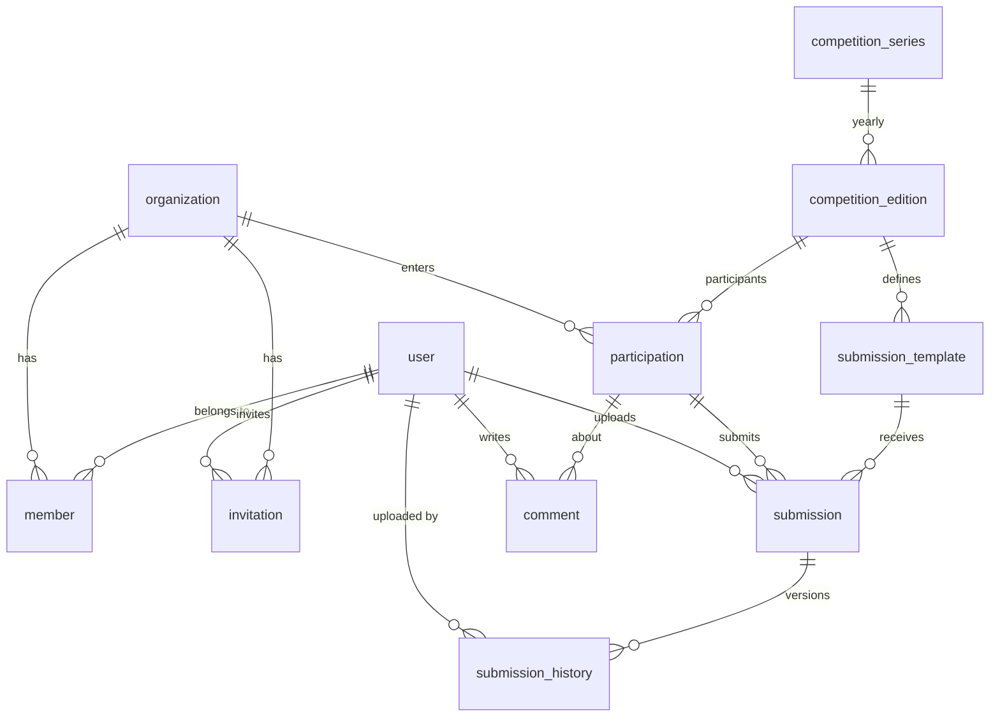

# ロボコン情報共有サービス 仕様書

**バージョン:** 0.3.1  
**最終更新:** 2026-03-21

---

## 1. サービス概要

ロボコンに出場した学校同士の情報共有を目的としたWebサービス。過去の大会情報のアーカイブと、出場校間での審査資料の相互共有を主要機能とする。

初期対象は NHK学生ロボコンおよびその類似大会（ABUロボコン等）。

---

## 2. 技術スタック

| レイヤー | 技術 | 備考 |
|----------|------|------|
| フロントエンド | Next.js (App Router) | Server Actions不使用、API経由でバックエンドと通信 |
| バックエンド | Hono | hono/zod-openapi によるOpenAPI自動生成 |
| DB | PostgreSQL | |
| ORM | Drizzle ORM | Better Auth の Drizzle アダプター利用 |
| 認証 | Better Auth | Organization プラグインで大学・招待・ロール管理 |
| ファイルストレージ | S3互換 (R2, MinIO, AWS S3等) | 署名付きURLでのアップロード/ダウンロード |
| メール送信 | SendGrid | 抽象化レイヤー経由で差し替え可能に |
| リンター / フォーマッター | Biome | ESLint + Prettier の代替。高速な統合ツール |
| 型検査 | tsc (TypeScript Compiler) | `--noEmit` でCI・pre-commitの型チェックに使用 |
| テスト | Vitest | ユニットテスト・統合テスト。Hono のルートテストにも使用 |
| デプロイ | Docker Compose | 開発・テスト・本番共通の起点 |

### 2.1 アーキテクチャ方針

```
┌──────────────┐     REST API (JSON)     ┌──────────────┐
│  Next.js     │ ◄─────────────────────► │  Hono API    │
│  (Frontend)  │                         │  (Backend)   │
└──────────────┘                         └──────┬───────┘
                                                │
                         ┌──────────────────────┼──────────────────────┐
                         ▼                      ▼                      ▼
                   ┌──────────┐          ┌──────────┐          ┌──────────┐
                   │PostgreSQL│          │Better Auth│          │  MinIO   │
                   │          │          │(認証/認可) │          │(S3互換)  │
                   └──────────┘          └──────────┘          └──────────┘
                                                                     │
                                                ┌────────────────────┘
                                                ▼
                                         ┌──────────┐
                                         │ SendGrid │
                                         │(メール)   │
                                         └──────────┘
```

- フロントエンドは Next.js の App Router を使用するが、Server Actions は使用しない
- すべてのデータ操作は Hono バックエンドの REST API を経由する
- Better Auth は Hono に統合し、認証エンドポイントを `/api/auth/*` にマウントする
- ファイルアップロードはバックエンドが署名付きURLを発行し、フロントエンドからS3に直接アップロードする
- メール送信は `EmailService` インターフェースで抽象化し、SendGrid 実装を注入する

### 2.2 Docker Compose 構成

```yaml
services:
  frontend:        # Next.js (port 3000)
  backend:         # Hono API (port 8787)
  db:              # PostgreSQL (port 5432)
  minio:           # S3互換ストレージ (port 9000 / console 9001)
  createbuckets:   # MinIO 初期バケット作成 (起動時のみ)
```

本番環境ではMinIOをマネージドS3互換サービスに、PostgreSQLをマネージドDBに差し替え可能。Docker Compose構成がそのままテスト環境としても機能する。

### 2.3 メール送信の抽象化

```typescript
// メールサービスのインターフェース
interface EmailService {
  sendEmail(params: {
    to: string;
    subject: string;
    html: string;
    text?: string;
  }): Promise<{ success: boolean; messageId?: string }>;
}

// SendGrid 実装
class SendGridEmailService implements EmailService {
  constructor(private apiKey: string, private fromAddress: string) {}
  async sendEmail(params) { /* SendGrid API 呼び出し */ }
}

// 開発用コンソール出力実装
class ConsoleEmailService implements EmailService {
  async sendEmail(params) { console.log("[EMAIL]", params); return { success: true }; }
}
```

開発環境では `ConsoleEmailService` を使用し、本番では環境変数 `EMAIL_PROVIDER=sendgrid` で切り替える。

### 2.4 開発ツールチェーン

#### Biome（リンター / フォーマッター）

ESLint + Prettier を Biome に一本化する。単一ツールで lint と format を高速に実行できるため、CI の実行時間短縮とツール管理の簡素化が見込める。

#### tsc（型検査）

TypeScript のコンパイルは各ツール（Next.js, Hono/tsx, Vitest）が内部で行うため、tsc はビルドには使用しない。`tsc --noEmit` を型検査専用として CI および pre-commit で実行する。

```jsonc
// tsconfig.json（ルート — プロジェクトリファレンス方式）
{
  "compilerOptions": {
    "strict": true,
    "target": "ES2022",
    "module": "ESNext",
    "moduleResolution": "bundler",
    "esModuleInterop": true,
    "skipLibCheck": true,
    "resolveJsonModule": true,
    "isolatedModules": true,
    "noEmit": true
  },
  "references": [
    { "path": "apps/frontend" },
    { "path": "apps/backend" },
    { "path": "packages/shared" }
  ]
}
```

各 `apps/` と `packages/` はそれぞれ独自の `tsconfig.json` を持ち、ルートの設定を `extends` する。

#### Vitest（テスト）

テストランナーとして Vitest を使用する。ユニットテスト・統合テストの両方を単一のツールで扱う。

```typescript
// vitest.workspace.ts（ルートに配置）
import { defineWorkspace } from "vitest/config";

export default defineWorkspace([
  "apps/backend",
  "apps/frontend",
  "packages/shared",
]);
```

**テストの分類と配置:**

| 種別 | 対象 | 配置 | 実行タイミング |
|------|------|------|---------------|
| ユニットテスト | サービス層、ユーティリティ、権限判定ロジック | `*.test.ts`（対象ファイルと同階層） | 常時（CI + ローカル） |
| 統合テスト | API ルート（Hono の `app.request` を使用） | `__tests__/` ディレクトリ | CI（テスト用 DB を Docker Compose で起動） |
| フロントエンドテスト | React コンポーネント、カスタムフック | `*.test.tsx`（対象ファイルと同階層） | CI + ローカル |

バックエンドの統合テストでは Hono の `app.request()` メソッドを使い、HTTP サーバーを起動せずにルートをテストする。テスト用の PostgreSQL は Docker Compose で起動し、テストごとにトランザクションをロールバックして分離する。

#### monorepo ルートの npm scripts

```jsonc
// package.json（ルート）
{
  "scripts": {
    "dev": "pnpm --filter './apps/*' --parallel dev",
    "build": "pnpm --filter './apps/*' build",
    "check": "biome check .",
    "check:fix": "biome check --write .",
    "typecheck": "tsc -b --noEmit",
    "test": "vitest run",
    "test:watch": "vitest",
    "test:coverage": "vitest run --coverage",
    "ci": "pnpm check && pnpm typecheck && pnpm test"
  }
}
```

`pnpm ci` を実行すると、Biome による lint/format チェック → tsc による型検査 → Vitest によるテスト実行 の順に走る。CI パイプラインでもこのコマンドを使用する。

---

## 3. ユーザーロールと権限

### 3.1 ロール一覧

| ロール | 説明 |
|--------|------|
| **システム管理者 (admin)** | サービス全体を管理する運営スタッフ（複数人）。細かい権限分離は初期段階では行わない |
| **代表者 (owner)** | 大学ごとの管理者。Better Auth Organization の `owner` ロールに対応。複数人設置可能 |
| **メンバー (member)** | 大学に所属する一般ユーザー。Better Auth Organization の `member` ロールに対応 |

### 3.2 権限マトリクス

| 操作 | admin | owner | member | 未認証 |
|------|-------|-------|--------|--------|
| 大会シリーズ / 大会回の作成・編集 | ✅ | ❌ | ❌ | ❌ |
| ルール資料の登録・編集 | ✅ | ❌ | ❌ | ❌ |
| 大会概要・ルールの閲覧 | ✅ | ✅ | ✅ | ✅（公開） |
| 出場登録 (Participation) の管理 | ✅ | ❌ | ❌ | ❌ |
| 資料種別テンプレートの管理 | ✅ | ❌ | ❌ | ❌ |
| 自校の資料アップロード・差し替え | ✅ | ✅ | ✅ | ❌ |
| 自校の資料削除 | ✅ | ✅ | ❌ | ❌ |
| 他校の資料閲覧（条件付き） | ✅ | ✅ | ✅ | ❌ |
| コメントの投稿 | ✅ | ✅ | ✅ | ❌ |
| 自分のコメントの編集・削除 | ✅ | ✅ | ✅ | ❌ |
| 他者のコメントの削除 | ✅ | ❌ | ❌ | ❌ |
| 大学メンバーの招待 | ✅ | ✅ | ❌ | ❌ |
| 代表者権限の移譲・付与 | ✅ | ✅ | ❌ | ❌ |
| 大学の作成 | ✅ | ❌ | ❌ | ❌ |

---

## 4. データモデル

### 4.1 エンティティ一覧

Better Auth が管理するテーブル（user, session, account, organization, member, invitation）と、
アプリケーション固有のテーブルに分かれる。

#### Better Auth 管理テーブル（Organization プラグイン）

| テーブル名 | 本サービスでの意味 | 備考 |
|------------|-------------------|------|
| user | ユーザーアカウント | 永年有効。メール、表示名等 |
| session | ログインセッション | Better Auth が自動管理 |
| account | 認証プロバイダー連携 | Google OAuth 等 |
| organization | **大学** | name, slug, logo 等 |
| member | **ユーザーと大学の所属関係** | role: "owner" / "member" |
| invitation | **大学への招待** | メール招待、有効期限付き |

#### アプリケーション固有テーブル

**competition_series（大会シリーズ）**

| カラム | 型 | 説明 |
|--------|-----|------|
| id | uuid (PK) | |
| name | text NOT NULL | 例: "NHK学生ロボコン" |
| description | text | 大会シリーズの説明 |
| external_links | jsonb | 関連リンク集 `[{label, url}]` |
| created_at | timestamptz NOT NULL | DEFAULT now() |
| updated_at | timestamptz NOT NULL | DEFAULT now() |

**competition_edition（大会回）**

| カラム | 型 | 説明 |
|--------|-----|------|
| id | uuid (PK) | |
| series_id | uuid NOT NULL (FK → competition_series) | |
| year | integer NOT NULL | 開催年 |
| name | text NOT NULL | 例: "NHK学生ロボコン2024" |
| description | text | その年のテーマ等 |
| rule_documents | jsonb | 運営が登録するルール資料 `[{label, s3_key, mime_type}]` |
| sharing_status | text NOT NULL | `draft` / `accepting` / `sharing` / `closed` |
| external_links | jsonb | `[{label, url}]` |
| created_at | timestamptz NOT NULL | |
| updated_at | timestamptz NOT NULL | |

`sharing_status` の意味:

- `draft`: 準備中。出場校には非表示
- `accepting`: 資料受付中。アップロード可能だが、他校の資料は閲覧不可
- `sharing`: 相互共有中。アップロード済みの大学は他校の資料を閲覧可能
- `closed`: 締切後。新規アップロード不可、閲覧権限は維持

通常運用では最初から `sharing` にして相互閲覧を即時有効にする。公平性の観点で問題が生じた場合に `accepting` → `sharing` の切り替えを利用する。

**participation（出場登録）**

| カラム | 型 | 説明 |
|--------|-----|------|
| id | uuid (PK) | |
| edition_id | uuid NOT NULL (FK → competition_edition) | |
| university_id | text NOT NULL (FK → organization.id) | Better Auth の organization.id |
| team_name | text | チーム名（複数チームの場合）。NULLなら大学名で表示 |
| created_at | timestamptz NOT NULL | |

UNIQUE制約: `(edition_id, university_id, team_name)` — 同一大会回で同じ大学・同じチーム名の重複を防止。

**submission_template（資料種別テンプレート）**

| カラム | 型 | 説明 |
|--------|-----|------|
| id | uuid (PK) | |
| edition_id | uuid NOT NULL (FK → competition_edition) | |
| name | text NOT NULL | 例: "ビデオ審査", "コンセプトシート" |
| description | text | 説明文 |
| accept_type | text NOT NULL | `file` / `url` |
| allowed_extensions | text[] | `file` の場合: `["pdf"]`, `["pdf","pptx"]` 等 |
| url_pattern | text | `url` の場合のバリデーション（例: `youtube.com` ドメイン制限） |
| max_file_size_mb | integer NOT NULL | デフォルト100。`file` の場合の上限（MB） |
| is_required | boolean NOT NULL | DEFAULT false |
| sort_order | integer NOT NULL | DEFAULT 0 |
| created_at | timestamptz NOT NULL | |

**submission（提出資料 — 現行版）**

| カラム | 型 | 説明 |
|--------|-----|------|
| id | uuid (PK) | |
| template_id | uuid NOT NULL (FK → submission_template) | |
| participation_id | uuid NOT NULL (FK → participation) | どのチームの提出か |
| submitted_by | text NOT NULL (FK → user.id) | 最終更新したユーザー |
| version | integer NOT NULL | DEFAULT 1。差し替えるたびにインクリメント |
| file_s3_key | text | `file` の場合の S3 キー |
| file_name | text | 元のファイル名 |
| file_size_bytes | bigint | |
| file_mime_type | text | |
| url | text | `url` の場合のURL |
| created_at | timestamptz NOT NULL | 初回作成日時 |
| updated_at | timestamptz NOT NULL | 最終更新日時 |

UNIQUE制約: `(template_id, participation_id)` — 1テンプレート×1チームにつき現行版は1つのみ。

**submission_history（提出資料の履歴）**

| カラム | 型 | 説明 |
|--------|-----|------|
| id | uuid (PK) | |
| submission_id | uuid NOT NULL (FK → submission) | |
| version | integer NOT NULL | 何番目のバージョンか |
| submitted_by | text NOT NULL (FK → user.id) | この版をアップロードしたユーザー |
| file_s3_key | text | |
| file_name | text | |
| file_size_bytes | bigint | |
| file_mime_type | text | |
| url | text | |
| created_at | timestamptz NOT NULL | この版のアップロード日時 |

差し替え時の動作: 現行の submission の内容を submission_history にコピーした上で、submission を新しいデータで上書きし version をインクリメントする。旧バージョンのS3ファイルは削除せず保持する（永久保存）。

**comment（コメント）**

| カラム | 型 | 説明 |
|--------|-----|------|
| id | uuid (PK) | |
| participation_id | uuid NOT NULL (FK → participation) | コメント対象のチーム |
| edition_id | uuid NOT NULL (FK → competition_edition) | 非正規化。クエリ効率化のため |
| author_id | text NOT NULL (FK → user.id) | コメント投稿者 |
| body | text NOT NULL | コメント本文（Markdown可） |
| created_at | timestamptz NOT NULL | |
| updated_at | timestamptz NOT NULL | |
| deleted_at | timestamptz | 論理削除。NULLなら有効 |

コメントはフラット構造（返信・スレッド機能なし）。出場チーム（participation）単位に紐づき、そのチームの全資料に対するコメントとして扱う。閲覧権限は資料の閲覧権限と同一（他校の資料を見られるユーザーはコメントも見られる）。

### 4.2 ER図



### 4.3 インデックス設計

| テーブル | インデックス | 目的 |
|----------|------------|------|
| participation | `(edition_id, university_id)` | 大会回×大学での出場チーム検索 |
| submission | `(template_id, participation_id)` UNIQUE | 現行版の一意性保証 |
| submission | `(participation_id)` | チーム単位の提出状況取得 |
| submission_history | `(submission_id, version)` | バージョン順の履歴取得 |
| comment | `(participation_id, deleted_at)` | チーム単位のコメント一覧（論理削除除外） |
| comment | `(edition_id, deleted_at)` | 大会回全体のコメント一覧 |
| competition_edition | `(series_id, year)` | シリーズ内の年度検索 |

---

## 5. 閲覧権限ロジック

### 5.1 他校資料の閲覧条件

大会回 E において、ユーザー U が他校の資料を閲覧できる条件:

```
1. E の sharing_status が "sharing" または "closed" である
2. U がいずれかの大学 X に所属している (member テーブル)
3. 大学 X が大会回 E に出場登録している (participation テーブル)
4. 大学 X の出場登録に紐づく submission が1つ以上存在する
```

条件を満たした場合、大会回 E の全資料種別の他校資料、および他校へのコメントを閲覧可能（大会回単位の一括判定）。

### 5.2 同一大学の複数チーム

大学 X のチーム1とチーム2は互いの資料・コメントを無条件で閲覧可能。閲覧権限の判定は「大学」単位。

### 5.3 admin の特例

admin ロールを持つユーザーは全資料・全コメントを閲覧可能。

### 5.4 コメントの権限

| 操作 | 条件 |
|------|------|
| コメント閲覧 | 資料閲覧権限と同一 |
| コメント投稿 | 資料閲覧権限を持つログインユーザー |
| コメント編集 | コメント投稿者本人のみ |
| コメント削除 | コメント投稿者本人 または admin |

### 5.5 擬似コード

```typescript
async function canViewOtherSubmissions(
  userId: string,
  editionId: string
): Promise<boolean> {
  if (await isAdmin(userId)) return true;

  const edition = await getEdition(editionId);
  if (!["sharing", "closed"].includes(edition.sharingStatus)) return false;

  const universityIds = await getUserUniversityIds(userId);

  for (const univId of universityIds) {
    const hasSubmission = await hasAnySubmission(univId, editionId);
    if (hasSubmission) return true;
  }

  return false;
}

// コメント投稿可否 = 閲覧権限と同一
const canComment = canViewOtherSubmissions;
```

---

## 6. 認証・招待フロー

### 6.1 Better Auth 構成

```typescript
import { betterAuth } from "better-auth";
import { organization } from "better-auth/plugins";
import { drizzleAdapter } from "better-auth/adapters/drizzle";
import { db } from "./db";
import { emailService } from "./email";

export const auth = betterAuth({
  database: drizzleAdapter(db, { provider: "pg" }),
  emailAndPassword: { enabled: true },
  socialProviders: {
    google: {
      clientId: process.env.GOOGLE_CLIENT_ID!,
      clientSecret: process.env.GOOGLE_CLIENT_SECRET!,
    },
  },
  plugins: [
    organization({
      async sendInvitationEmail(data) {
        const inviteLink = `${process.env.APP_URL}/invite/${data.id}`;
        await emailService.sendEmail({
          to: data.email,
          subject: `${data.organization.name} への招待`,
          html: renderInvitationTemplate({
            inviterName: data.inviter.user.name,
            organizationName: data.organization.name,
            inviteLink,
          }),
        });
      },
    }),
  ],
});
```

### 6.2 招待フロー

```
[admin]
  │ 大学 (Organization) を作成
  │ 初期代表者のメールアドレスを指定して招待
  ▼
[代表者 (owner)]
  │ 招待メールのリンクからアカウント作成 or ログイン
  │ 招待を承認して大学に参加
  │ 他のメンバーをメールで招待（role: member）
  │ 他のメンバーに owner 権限を付与可能
  ▼
[メンバー (member)]
  │ 招待メールのリンクからアカウント作成 or ログイン
  │ 招待を承認して大学に参加
  │ 自校の資料アップロード・コメント投稿等が可能に
```

### 6.3 複数大学所属

- ユーザーは複数の Organization (大学) に所属可能
- Better Auth の `activeOrganization` 機能でビューを切り替える
- フロントエンドにはOrganization切り替えUIを設置
- API リクエスト時は `X-Organization-Id` ヘッダーで現在のコンテキストを指定

---

## 7. 主要画面一覧

### 7.1 公開画面（未認証でもアクセス可）

| 画面 | パス | 説明 |
|------|------|------|
| トップページ | `/` | サービス紹介 |
| 大会シリーズ一覧 | `/competitions` | |
| 大会回詳細 | `/competitions/:seriesSlug/:year` | ルール、リンク集 |
| ログイン | `/auth/login` | |
| アカウント作成 | `/auth/register` | |
| 招待承認 | `/invite/:invitationId` | |

### 7.2 認証済み画面

| 画面 | パス | 説明 |
|------|------|------|
| ダッシュボード | `/dashboard` | 所属大学の大会一覧、最近の更新 |
| 大学切り替え | (ヘッダードロップダウン) | 所属大学のコンテキスト切り替え |
| 大会回 - 資料提出 | `/editions/:id/submit` | 自校の資料アップロード |
| 大会回 - 資料一覧 | `/editions/:id/submissions` | 全出場校の資料一覧（閲覧条件付き） |
| チーム詳細 | `/editions/:id/teams/:participationId` | チームの全資料 + コメント欄 |
| 資料バージョン履歴 | `/editions/:id/submissions/:submissionId/history` | 差し替え履歴の一覧 |
| 大学設定 | `/university/settings` | メンバー管理、招待 |
| アカウント設定 | `/account/settings` | プロフィール、パスワード変更 |

### 7.3 管理画面

| 画面 | パス | 説明 |
|------|------|------|
| 管理ダッシュボード | `/admin` | |
| 大会シリーズ管理 | `/admin/series` | CRUD |
| 大会回管理 | `/admin/editions` | CRUD、sharing_status の切り替え |
| 出場登録管理 | `/admin/editions/:id/participations` | 出場校・チーム登録 |
| 資料種別テンプレート管理 | `/admin/editions/:id/templates` | テンプレート CRUD、前回からのコピー |
| 大学管理 | `/admin/universities` | 大学の作成、代表者招待 |

### 7.4 一覧画面のページング仕様

- 無限スクロールは採用しない
- URL クエリに `page`, `pageSize`, `sort`, `q` を保持する
- フィルタ変更時は `page=1` に戻す
- ページサイズ候補は `10`, `20`, `50` とする
- テーブルが主 UI だが、モバイルではカード表示にフォールバックする

---

## 8. API エンドポイント設計

### 8.1 認証（Better Auth が提供）

```
POST/GET /api/auth/*    -- Better Auth ハンドラー
```

### 8.2 公開 API

```
GET /api/series                              -- 大会シリーズ一覧
GET /api/series/:id                          -- 大会シリーズ詳細
GET /api/editions                            -- 大会回一覧 (?series_id=...)
GET /api/editions/:id                        -- 大会回詳細（ルール資料含む）
```

### 8.3 認証済み API — 資料提出

```
GET    /api/editions/:id/templates           -- 資料種別テンプレート一覧
GET    /api/editions/:id/my-submissions      -- 自校の提出状況
POST   /api/submissions                      -- 資料提出（メタデータ登録）
PUT    /api/submissions/:id                  -- 資料差し替え（旧版は自動で履歴に保存）
DELETE /api/submissions/:id                  -- 資料削除（owner/admin のみ）
```

### 8.4 認証済み API — 資料閲覧

```
GET    /api/editions/:id/submissions         -- 全出場校の資料一覧（権限チェック付き）
GET    /api/submissions/:id/download         -- 署名付きダウンロードURL取得
GET    /api/submissions/:id/history          -- 提出履歴一覧
GET    /api/submission-history/:historyId/download  -- 旧版のダウンロード
```

### 8.5 認証済み API — コメント

```
GET    /api/participations/:id/comments      -- チームへのコメント一覧
POST   /api/participations/:id/comments      -- コメント投稿
PUT    /api/comments/:id                     -- コメント編集（本人のみ）
DELETE /api/comments/:id                     -- コメント削除（本人 or admin）
```

### 8.6 認証済み API — ファイルアップロード

```
POST   /api/upload/presign                   -- S3 署名付きアップロードURL取得
```

### 8.7 認証済み API — 大学管理（owner のみ）

```
GET    /api/university/members               -- メンバー一覧
POST   /api/university/invite                -- メンバー招待（Better Auth 経由）
PUT    /api/university/members/:id/role      -- ロール変更
DELETE /api/university/members/:id           -- メンバー削除
```

### 8.8 管理 API（admin のみ）

```
# 大会シリーズ
POST   /api/admin/series
PUT    /api/admin/series/:id
DELETE /api/admin/series/:id

# 大会回
POST   /api/admin/editions
PUT    /api/admin/editions/:id
DELETE /api/admin/editions/:id
PUT    /api/admin/editions/:id/status        -- sharing_status 変更

# ルール資料
POST   /api/admin/editions/:id/rules/presign -- ルール資料アップロードURL
PUT    /api/admin/editions/:id/rules         -- ルール資料メタデータ更新

# 出場登録
POST   /api/admin/editions/:id/participations
PUT    /api/admin/participations/:id
DELETE /api/admin/participations/:id

# 資料種別テンプレート
POST   /api/admin/editions/:id/templates
PUT    /api/admin/templates/:id
DELETE /api/admin/templates/:id
POST   /api/admin/editions/:id/templates/copy-from/:sourceEditionId

# 大学管理
POST   /api/admin/universities
GET    /api/admin/universities
```

### 8.9 ページング仕様

#### クエリパラメータ

| パラメータ | 型 | 既定値 | 説明 |
|------------|----|--------|------|
| page | integer | 1 | 1 始まり |
| pageSize | integer | 20 | 最大 100 |
| q | string | なし | 部分一致検索 |
| sort | string | エンドポイントごと | `field:asc` または `field:desc` |

#### sort のルール

- 単一ソートのみを初期実装で許可する
- 指定可能なフィールドはエンドポイントごとに OpenAPI に列挙する
- 不正な sort は 422 を返す
-

---

## 9. ファイルストレージ設計

### 9.1 制約

| 項目 | 値 |
|------|-----|
| 1ファイルあたりの上限 | 100MB |
| 対応形式（file型テンプレート） | テンプレートの `allowed_extensions` で制限 |
| 対応形式（url型テンプレート） | `url_pattern` でドメイン制限（例: youtube.com, youtu.be） |
| データ保持期間 | 永久保存（履歴含む） |

### 9.2 S3 キー命名規則

```
rules/{edition_id}/{uuid}_{filename}
submissions/{edition_id}/{participation_id}/{template_id}/v{version}_{uuid}_{filename}
```

バージョン付きのキーにすることで、差し替え時に旧ファイルを上書きせず保持する。

### 9.3 アップロードフロー（資料提出）

```
1. フロントエンド → バックエンド: POST /api/upload/presign
   Body: { participationId, templateId, fileName, contentType, fileSizeBytes }
   バックエンドがバリデーション:
     - ユーザーの所属確認
     - テンプレートの accept_type が "file" か
     - 拡張子が allowed_extensions に含まれるか
     - content_type と拡張子の整合性
     - fileSizeBytes がテンプレート上限以下か

2. バックエンド → フロントエンド: { presignedUrl, s3Key, expiresIn, templateMaxFileSizeMb }

3. フロントエンド → S3: PUT (署名付きURL で直接アップロード)
   - presign 時に指定した `Content-Length` / `Content-Type` と一致する内容で送信する
   - プログレスバー表示

4. フロントエンド → バックエンド: POST /api/submissions (新規) or PUT /api/submissions/:id (差し替え)
   Body: { templateId, participationId, s3Key, fileName, fileSizeBytes, mimeType }
   バックエンドが再検証:
     - `s3Key` が `edition/participation/template/version/fileName` と一致すること
     - S3 上の `ContentLength` と `fileSizeBytes` が一致すること
     - S3 上の `ContentType` と `mimeType` が一致すること
   - 差し替えの場合: 現行版を submission_history に退避してから更新
```

### 9.4 ダウンロードフロー

```
1. フロントエンド → バックエンド: GET /api/submissions/:id/download
   - 権限チェック（閲覧条件 + 所属確認）
   - 署名付きダウンロードURL返却（有効期限: 5分）

2. フロントエンド → S3: GET (署名付きURL で直接ダウンロード)
```

旧バージョンも同様に `/api/submission-history/:historyId/download` で取得可能。
submission / submission_history の API レスポンスには内部管理用の `fileS3Key` を含めない。

### 9.5 URL 提出の場合

YouTube限定公開URLの場合は S3 を経由せず、submission テーブルの `url` カラムに直接保存する。差し替え時は同様に旧URLを submission_history に退避する。バリデーションとして `url_pattern` に基づきドメインが `youtube.com` または `youtu.be` であることを確認する。

---

## 10. コメント機能の詳細

### 10.1 概要

出場チーム（participation）単位でコメントを投稿できる。そのチームの全資料に対する総合的なフィードバック欄として機能する。

### 10.2 仕様

- フラット構造（返信・スレッド機能なし）
- Markdown 記法をサポート（フロントエンドでレンダリング）
- 論理削除（deleted_at に日時をセット）
- コメント投稿者の所属大学名・ユーザー名を表示
- 閲覧権限は資料閲覧権限と同一

### 10.3 UI イメージ

チーム詳細画面 (`/editions/:id/teams/:participationId`) の下部に、資料一覧の後にコメント欄を配置する。

```
┌─────────────────────────────────────────┐
│ ○○大学 Aチーム                          │
│                                         │
│ [提出資料]                              │
│  📄 コンセプトシート (v3)  [DL] [履歴]   │
│  🎥 ビデオ審査URL          [開く]        │
│                                         │
│ ─────────────────────────────────────── │
│ [コメント] (3件)                         │
│                                         │
│  △△大学 / 田中太郎  2024-12-01          │
│  メカナムホイールの採用が面白いです…      │
│                                         │
│  □□大学 / 佐藤花子  2024-12-02          │
│  射出機構の詳細をもう少し知りたいです     │
│                                         │
│  ┌─────────────────────────────┐        │
│  │ コメントを入力…             │        │
│  │                             │        │
│  │              [投稿]         │        │
│  └─────────────────────────────┘        │
└─────────────────────────────────────────┘
```

---

## 11. ファイル履歴機能の詳細

### 11.1 概要

資料の差し替え時に旧バージョンを自動保存し、いつでも過去のバージョンを閲覧・ダウンロードできる。

### 11.2 差し替えフロー

```
1. ユーザーが既存の submission に対して差し替えをリクエスト
2. バックエンドが現行版のデータを submission_history にコピー
3. submission テーブルを新しいデータで上書き、version をインクリメント
4. 旧バージョンの S3 ファイルは削除しない
```

### 11.3 UI イメージ

資料カードに「履歴」ボタンを設置し、クリックで履歴モーダルまたは画面遷移。

```
┌───────────────────────────────────────────┐
│ コンセプトシート  現行: v3                  │
│                                           │
│  v3 (現行)  田中太郎  2024-12-15  [DL]     │
│  v2         田中太郎  2024-12-10  [DL]     │
│  v1         佐藤花子  2024-12-01  [DL]     │
└───────────────────────────────────────────┘
```

### 11.4 閲覧権限

過去バージョンの閲覧権限は現行版と同一。現行版を閲覧できるユーザーは全バージョンを閲覧・ダウンロード可能。

---

## 12. Docker Compose 構成

### 12.1 docker-compose.yml（概要）

```yaml
version: "3.9"

services:
  db:
    image: postgres:16
    environment:
      POSTGRES_USER: robocon
      POSTGRES_PASSWORD: ${DB_PASSWORD}
      POSTGRES_DB: robocon
    volumes:
      - pgdata:/var/lib/postgresql/data
    ports:
      - "5432:5432"

  minio:
    image: minio/minio
    command: server /data --console-address ":9001"
    environment:
      MINIO_ROOT_USER: ${MINIO_ROOT_USER}
      MINIO_ROOT_PASSWORD: ${MINIO_ROOT_PASSWORD}
    volumes:
      - minio_data:/data
    ports:
      - "9000:9000"
      - "9001:9001"

  createbuckets:
    image: minio/mc
    depends_on:
      - minio
    entrypoint: >
      /bin/sh -c "
      mc alias set local http://minio:9000 $${MINIO_ROOT_USER} $${MINIO_ROOT_PASSWORD};
      mc mb --ignore-existing local/robocon-rules;
      mc mb --ignore-existing local/robocon-submissions;
      exit 0;
      "

  backend:
    build:
      context: .
      dockerfile: apps/backend/Dockerfile
    environment:
      DATABASE_URL: postgres://robocon:${DB_PASSWORD}@db:5432/robocon
      S3_ENDPOINT: http://minio:9000
      S3_ACCESS_KEY: ${MINIO_ROOT_USER}
      S3_SECRET_KEY: ${MINIO_ROOT_PASSWORD}
      S3_REGION: us-east-1
      S3_BUCKET_RULES: robocon-rules
      S3_BUCKET_SUBMISSIONS: robocon-submissions
      BETTER_AUTH_SECRET: ${BETTER_AUTH_SECRET}
      BETTER_AUTH_URL: http://localhost:8787
      APP_URL: http://localhost:3000
      EMAIL_PROVIDER: console  # 開発環境ではコンソール出力
      SENDGRID_API_KEY: ${SENDGRID_API_KEY:-}
      SENDGRID_FROM: ${SENDGRID_FROM:-noreply@example.com}
    depends_on:
      - db
      - minio
    ports:
      - "8787:8787"

  frontend:
    build:
      context: .
      dockerfile: apps/frontend/Dockerfile
    environment:
      NEXT_PUBLIC_API_URL: http://localhost:8787
    depends_on:
      - backend
    ports:
      - "3000:3000"

volumes:
  pgdata:
  minio_data:
```

### 12.2 環境変数（.env.example）

```bash
# Database
DB_PASSWORD=change_me_in_production

# MinIO (S3互換)
MINIO_ROOT_USER=minioadmin
MINIO_ROOT_PASSWORD=minioadmin

# Better Auth
BETTER_AUTH_SECRET=generate-a-random-32-char-string

# Email (本番用)
EMAIL_PROVIDER=console          # console | sendgrid
SENDGRID_API_KEY=
SENDGRID_FROM=noreply@example.com

# Google OAuth (任意)
GOOGLE_CLIENT_ID=
GOOGLE_CLIENT_SECRET=
```

### 12.3 開発時の起動手順

```bash
cp .env.example .env
# .env を編集
docker compose up -d
# DB マイグレーション
pnpm --filter backend db:migrate
# 開発サーバー起動（ホットリロード）
pnpm dev
```

### 12.4 CI / 品質チェック

```bash
# lint + format チェック → 型検査 → テスト を一括実行
pnpm ci

# 個別実行
pnpm check          # Biome lint/format チェック
pnpm check:fix      # Biome 自動修正
pnpm typecheck      # tsc --noEmit
pnpm test           # Vitest 実行
pnpm test:watch     # Vitest ウォッチモード
pnpm test:coverage  # カバレッジ付きテスト
```

---

## 13. プロジェクト構成（monorepo）

```
robocon-hub/
├── docker-compose.yml
├── .env.example
├── package.json                 # workspaces 定義 + ルート scripts
├── pnpm-workspace.yaml
├── biome.json                   # Biome 設定（monorepo 全体）
├── tsconfig.json                # ルート tsconfig（プロジェクトリファレンス）
├── vitest.workspace.ts          # Vitest ワークスペース設定
│
├── apps/
│   ├── frontend/                # Next.js
│   │   ├── Dockerfile
│   │   ├── package.json
│   │   ├── tsconfig.json        # extends ルート設定 + Next.js 固有
│   │   ├── vitest.config.ts
│   │   ├── next.config.ts
│   │   └── src/
│   │       ├── app/             # App Router pages
│   │       ├── components/      # UIコンポーネント
│   │       │   └── *.test.tsx   # コンポーネントテスト（同階層配置）
│   │       ├── lib/             # API クライアント、ユーティリティ
│   │       │   └── *.test.ts
│   │       └── hooks/           # カスタムフック
│   │           └── *.test.ts
│   │
│   └── backend/                 # Hono API
│       ├── Dockerfile
│       ├── package.json
│       ├── tsconfig.json        # extends ルート設定
│       ├── vitest.config.ts
│       └── src/
│           ├── index.ts         # エントリーポイント
│           ├── auth.ts          # Better Auth 構成
│           ├── db/
│           │   ├── index.ts     # Drizzle インスタンス
│           │   ├── schema.ts    # Drizzle スキーマ定義
│           │   └── migrations/  # マイグレーションファイル
│           ├── routes/
│           │   ├── series.ts
│           │   ├── editions.ts
│           │   ├── submissions.ts
│           │   ├── comments.ts
│           │   ├── upload.ts
│           │   ├── university.ts
│           │   └── admin/
│           │       ├── series.ts
│           │       ├── editions.ts
│           │       ├── participations.ts
│           │       ├── templates.ts
│           │       └── universities.ts
│           ├── middleware/
│           │   ├── auth.ts       # 認証ミドルウェア
│           │   ├── admin.ts      # admin 権限チェック
│           │   └── organization.ts # 大学コンテキスト解決
│           ├── services/
│           │   ├── email/
│           │   │   ├── interface.ts   # EmailService インターフェース
│           │   │   ├── sendgrid.ts    # SendGrid 実装
│           │   │   └── console.ts     # 開発用コンソール実装
│           │   ├── storage.ts         # S3 操作
│           │   ├── permissions.ts     # 閲覧権限判定
│           │   └── permissions.test.ts # 権限ロジックのユニットテスト
│           ├── __tests__/             # 統合テスト
│           │   ├── setup.ts           # テスト用DB接続・トランザクション管理
│           │   ├── submissions.test.ts
│           │   ├── comments.test.ts
│           │   └── permissions.test.ts
│           └── lib/
│               └── config.ts          # 環境変数読み込み
│
└── packages/
    └── shared/                  # フロント・バック共有の型定義
        ├── package.json
        ├── tsconfig.json
        └── src/
            ├── types.ts         # API レスポンス型、共通 enum 等
            └── types.test.ts    # 型ガード等のテスト
```
